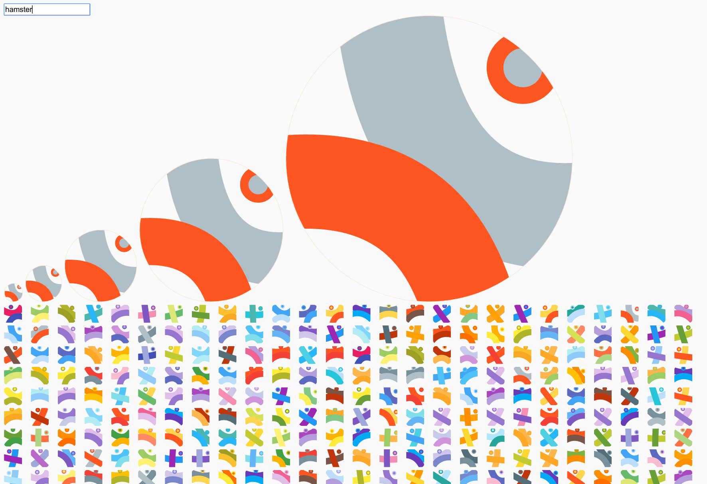

# Randicon

Randicon generates gravatar-like, slack-like icons based on the string hashcode.

## Usage

````html
  <!-- (1) Include randicon.min.js -->
  <script src="randicon.min.js"></script>

  <svg id="icon1" width="64" height="64"/>

  <script>
    // (2) Call randicon(id, string)
    var r = randicon("#icon1", "johnny-bravo@acme.com");
  </script>
````

## Example



## Development

````
npm install
bower install
gulp
````

## License

MIT

## Credits

Shoutout to @[Snapsvg](https://twitter.com/Snapsvg) guys.
